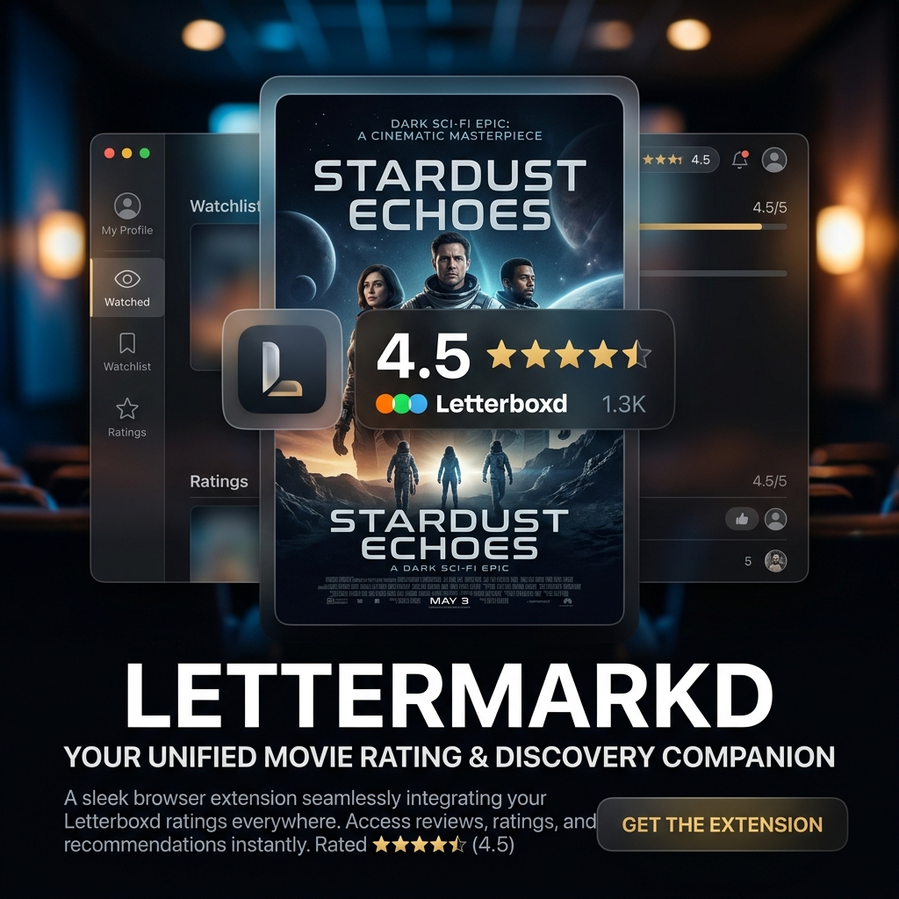

# 🎬 LetterMarkd



**Universal Letterboxd ratings and movie discovery for any webpage.**


## 📥 Installation

<a href="#"></a>
<a href="#"></a>
- **Chrome:** (Coming soon)

---

## 📖 Project Purpose

LetterMarkd is a premium browser extension designed for cinephiles who want instant movie context without leaving their current tab. It bridges the gap between your browsing experience and the world's leading film databases.

Simply highlight any movie title on any website—whether you're on Reddit, Wikipedia, or a news site—to instantly view a sleek glassmorphism overlay featuring ratings, reviews, financial data, and streaming availability.

### ✨ Features
* **🔍 Universal Discovery:** Highlight any text on any website to search for a movie match instantly.
* **📈 Comprehensive Stats:**
    * **Letterboxd:** Real-time ratings and recent community reviews.
    * **IMDb:** Integrated ratings and full release dates.
    * **Financials:** Budget and Worldwide Box Office data from Box Office Mojo.
* **🍿 Spoiler Blocker:** Advanced review parsing that hides spoilers by default with a "Click to Reveal" feature.
* **📺 Where to Watch:** Region-aware streaming provider detection powered by JustWatch.
* **⚡ Performance First:** Letterboxd data loads instantly (Stage 1), with secondary metadata (Stage 2) popping in asynchronously.
* **🔒 Privacy Minded:** No tracking, no data collection. Includes a built-in Allowlist/Blocklist system.

---

## 🛠️ Tech Stack

This project is built using:
* **Vanilla JavaScript** & **CSS** (Glassmorphism design system)
* **Scraper Engine v14:** Robust regex-based HTML parsing for high performance and resilience.
* **Manifest V3** (Chrome/Edge) and **Manifest V2** (Firefox).
* **Bash** for standard build automation and cross-browser manifest management.

---

## 💻 Local Setup Instructions

These instructions have been designed and tested for a clean local machine environment.

### Prerequisites
* [Node.js](https://nodejs.org/en) (Optional, for future linting)
* Git
* A Chromium-based browser (Chrome, Edge, Brave) or Firefox

### Step-by-Step Setup

1. **Clone the repository:**
   ```bash
   git clone https://github.com/Labreo/LetterMarkd.git
   cd LetterMarkd
   ```

2. **Build the extension:**
   Generate the clean, store-ready browser distributions:
   ```bash
   chmod +x build.sh
   ./build.sh
   ```
   *This will create a `dist/` directory containing `chrome/`, `firefox/`, and `edge/` builds.*

3. **Load the extension manually into your browser:**
   * **For Chrome:** Navigate to `chrome://extensions/`, toggle on "Developer mode", click "Load unpacked", and select the `dist/chrome/` folder.
   * **For Edge:** Navigate to `edge://extensions/`, toggle on "Developer mode", click "Load unpacked", and select `dist/edge/`.
   * **For Firefox:** Navigate to `about:debugging#/runtime/this-firefox`, click "Load Temporary Add-on", and select the `manifest.json` inside the `dist/firefox/` folder.

---

## 🤝 Contribution Guidelines

Contributions, issues, and feature requests are highly encouraged! 

We follow standard GitHub flow. If you're looking to contribute code, please ensure your changes maintain the "No API Key" scraping philosophy and adhere to the premium glassmorphism UI standards.

---

## 💬 Contact & Support

**Have questions or want to discuss a major feature?**
Reach out to the team at **Labreo**.

If this extension makes your movie discovery a little smoother, consider supporting the development! 

[](https://www.buymeacoffee.com/kakeroth)

---

## 📄 License

Distributed under the MIT License. See `LICENSE` for more information.

**Built with ❤️ by [Labreo](https://github.com/Labreo)**
